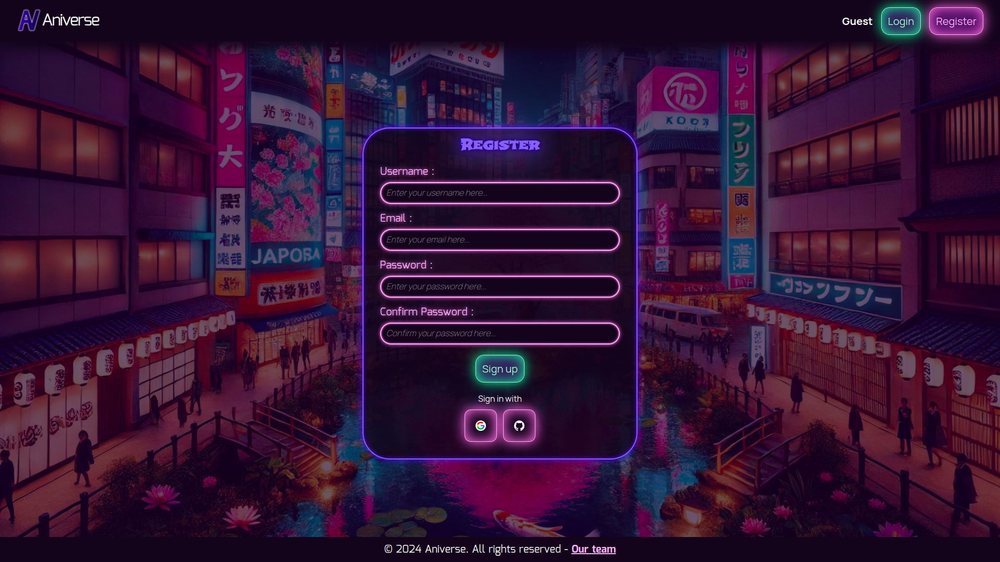
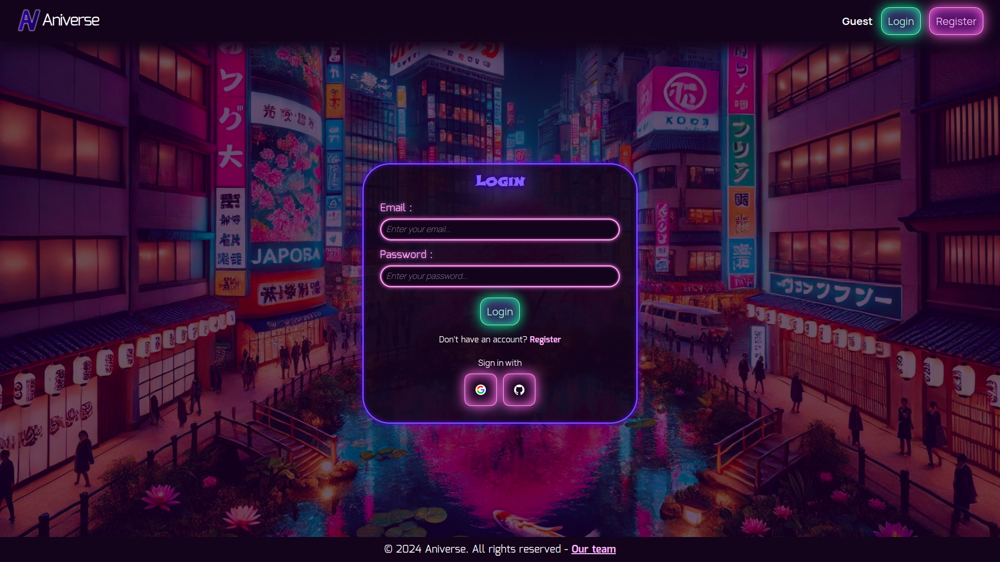

# Aniverse Forum

Welcome to **Aniverse**, a web-based platform designed to facilitate communication between users, allowing for post categorization, liking/disliking of posts and comments, and filtering of posts. This forum is built with a focus on simplicity, functionality, and scalability.

<div style="display:flex; justify-content:space-evenly;width:auto;margin:16px;">


</div>

## Features

- **User Communication**: Registered users can create posts and comments.
- **Categorization**: Associate posts with one or more categories.
- **Likes & Dislikes**: Users can like/dislike posts and comments.
- **Filtering**: Filter posts by categories, created posts, and liked posts.
- **Authentication**:
  - User registration with email and password.
  - Login and logout functionality with session cookies.
- **Advanced Features** (Optional Add-ons):
  - User notifications for post activity.
  - Activity tracking page for user actions.
  - Google and GitHub login integration.
  - Image uploads with size and type restrictions.
  - Forum moderation with user access levels (guest, user, moderator, admin).
  - Enhanced security with HTTPS, rate limiting, and encrypted cookies.

## Technologies Used

- **Backend**: [Go](https://golang.org/)
- **Database**: [SQLite](https://sqlite.org/index.html)
- **Docker**: For containerization and deployment.
- **Authentication**: Sessions and cookies, bcrypt for password encryption.
- **Security**: HTTPS, rate limiting, encrypted sessions.

## Requirements

- Go (1.XX or higher)
- Docker (for containerization)
- SQLite
- A modern web browser

## Setup Environment

1. **Ensure you have Go and Docker installed** on your machine.
2. **Configure environment variables**:
   - Database path.
   - Ports.
   - Optional: API keys for third-party authentication.

### Run Locally

```bash
go run cmd/api/main.go
```

### Access the Forum

Open your browser and go to [https://localhost:8080](https://localhost:8080).

This forum is also available online on [https://aniverse.spyrisk.xyz/](https://aniverse.spyrisk.xyz/).

## Usage

### Registration and Login

- Register with a unique email and username.
- Login to create posts and comments.

### Post Creation

- Add a new post with text content and optional categories.
- Include images (if enabled).

### Moderation

- Admins and moderators can manage posts and comments.
- Request moderation roles from admins.

### Notifications

- Get notified when your posts are liked, disliked, or commented on.

### Security

- HTTPS ensures secure communication.
- Rate limiting prevents abuse.
- Passwords are securely hashed.

## Contributing

We welcome contributions! Feel free to fork the repository and submit pull requests. Please ensure your code follows best practices and includes appropriate documentation.

## Acknowledgments

- [Go](https://golang.org/)
- [SQLite](https://sqlite.org/index.html)
- [Docker](https://www.docker.com/)
- [bcrypt](https://pkg.go.dev/golang.org/x/crypto/bcrypt)
- [UUID](https://pkg.go.dev/github.com/google/uuid)
